## `$ whoami`

Hey, I'm **Magomed Mutsulkhanov** (`mmutsulk`), a **back-end & systems developer** in training at **42 Mulhouse**.
I write **C** and **C++98** close to the system: **TCP servers**, **I/O multiplexing**, **process management**, **memory management** and **containerized infrastructure**.
I like understanding what runs under the hood, and building things that run on ports.

## `$ cat experience.log`

| When | Where | What |
| :--- | :--- | :--- |
| `now` | **42 Mulhouse** — Software engineering student | Peer-learning common core in **C / C++**: shell, IRC server, 3D raycaster, Docker stack. Team projects in Git (`ft_irc` ×3, `cub3d` ×2). |
| `now` | **Studi** — Systems & Networks Technician | **VLAN / trunking**, **DHCP**, router-on-a-stick (Cisco Packet Tracer), **Active Directory / LDAP** on **Windows Server 2022**, Debian services, **PowerShell** bulk user provisioning, cron backups. |

## `$ ps aux | grep in-progress`

> [!NOTE]
> **`ft_transcendence`** — *in progress* &nbsp;·&nbsp; last project of the 42 common core: a full-stack real-time web application (back-end, database, authentication, live game).

## `$ git log --graph --reverse common-core`

  

## `$ ls ~/back-end`

### [`ft_irc`](https://github.com/magomed955/ft_irc) — IRC server in C++98 (team of 3)
`C++98` `TCP/IP` `IPv4 sockets` `non-blocking I/O` `poll()` `I/O multiplexing` `RFC 1459 / 2812` `buffers` `signals`
- Server core: listening socket, client file descriptors, **send / receive buffers**, clean disconnections, signal handling
- `Server` / `Client` / `Channel` / `Parser` architecture, numeric replies and error handling
- Commands: `PASS` `NICK` `USER` `JOIN` `PART` `PRIVMSG` `NOTICE` `TOPIC` `KICK` `INVITE` `MODE` (`+i` `+t` `+k` `+o` `+l`)

### [`minishell`](https://github.com/magomed955/minishell) — a Bash-like UNIX shell in C
`C` `lexer / parser` `fork` `execve` `waitpid` `pipes` `dup2` `redirections` `heredoc` `environment` `signals` `exit status`
- Tokenizing and parsing of quotes, `$VAR` expansion, pipelines and `<` `>` `>>` `<<` redirections
- Process creation and fd plumbing, builtins (`cd` `echo` `env` `export` `unset` `pwd` `exit`), `Ctrl-C` / `Ctrl-\` / `Ctrl-D` handling

### [`inception`](https://github.com/magomed955/inception) — containerized web infrastructure
`Docker` `Docker Compose` `NGINX` `TLSv1.2 / 1.3` `WordPress` `PHP-FPM` `MariaDB` `Debian` `volumes` `bridge network` `secrets`
- 3 services built from custom **Dockerfiles**: NGINX as the only entry point on `443`, WordPress + PHP-FPM on `9000`, MariaDB on `3306`
- Persistent volumes, isolated Docker network, credentials through **Docker secrets**, deployed in a VM

## `$ ls ~/cpp`

  

| Module | Keywords |
| :--- | :--- |
| [`cpp00`](https://github.com/magomed955/cpp00) | namespaces, classes, member functions, `iostream`, `static`, `const` |
| [`cpp01`](https://github.com/magomed955/cpp01) | `new` / `delete`, pointers vs references, pointers to members, file streams, `switch` |
| [`cpp02`](https://github.com/magomed955/cpp02) | ad-hoc polymorphism, **operator overloading**, **Orthodox Canonical Form**, fixed-point numbers |
| [`cpp03`](https://github.com/magomed955/cpp03) | **inheritance**, constructors / destructors chaining, diamond problem, virtual inheritance |
| [`cpp04`](https://github.com/magomed955/cpp04) | subtype **polymorphism**, `virtual`, abstract classes, interfaces, deep copy |
| [`cpp05`](https://github.com/magomed955/cpp05) | **exceptions**, `try` / `catch`, custom exception classes |
| [`cpp06`](https://github.com/magomed955/cpp06) | `static_cast`, `dynamic_cast`, `reinterpret_cast`, scalar conversion, serialization |
| [`cpp07`](https://github.com/magomed955/cpp07) | function & class **templates**, generic containers |
| [`cpp08`](https://github.com/magomed955/cpp08) | templated **containers**, **iterators**, `<algorithm>`, `MutantStack` |
| [`cpp09`](https://github.com/magomed955/cpp09) | **STL**: `std::map` (BitcoinExchange), `std::stack` (RPN), `std::vector` / `std::deque` (PmergeMe, Ford-Johnson) |

## `$ ls ~/c`

| Project | Keywords |
| :--- | :--- |
| [`libft`](https://github.com/magomed955/libft) | libc re-implementation, linked lists, static library, `Makefile` |
| [`ft_printf`](https://github.com/magomed955/ft_printf) | **variadic functions** (`va_list`), format parsing, conversions `cspdiuxX%` |
| [`get_next_line`](https://github.com/magomed955/get_next_line) | `read()`, file descriptors, **static variables**, buffer management |
| [`push_swap`](https://github.com/magomed955/push_swap) | sorting algorithms, stacks, complexity optimization |
| [`minitalk`](https://github.com/magomed955/minitalk) | **UNIX signals** (`SIGUSR1` / `SIGUSR2`), client / server IPC, bit encoding |
| [`philosophers`](https://github.com/magomed955/philosophers) | **threads** (`pthread`), **mutexes**, race conditions, deadlocks |
| [`so_long`](https://github.com/magomed955/so_long) | MiniLibX, 2D game loop, map parsing, flood fill |
| [`cub3d`](https://github.com/magomed955/cub3d) | **raycasting** (DDA), MiniLibX, textures, collisions, `.cub` map parsing |
| [`minishell`](https://github.com/magomed955/minishell) | processes, pipes, redirections, signals, parsing |

## `$ ls ~/sysadmin`

| Project | Keywords |
| :--- | :--- |
| [`Born2beroot`](https://github.com/magomed955/Born2beroot) | Debian VM, LVM, SSH, UFW, `sudo` policy, password policy, cron monitoring script |
| [`NetPractice`](https://github.com/magomed955/NetPractice) | TCP/IP, IPv4 addressing, subnet masks, routing tables |
| [`inception`](https://github.com/magomed955/inception) | Docker, Docker Compose, NGINX, TLS, MariaDB |

## `$ which stack`

  

## `$ ./contact`

Open to internships & collaborations — back-end, systems, C / C++.

